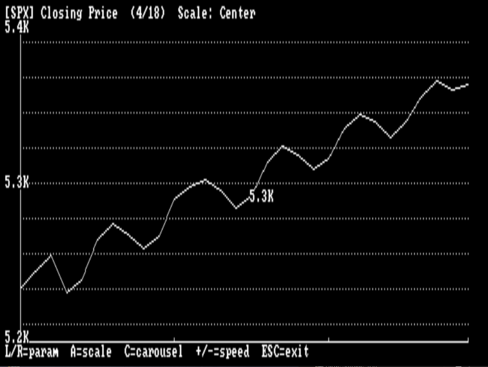

# QXGRAPH v1.1
### QUANTXT Graphing Utility — IBM PC/XT CGA Time-Series Visualizer



A stand-alone DOS graphing tool for the IBM PC/XT that renders financial and macroeconomic time-series data in CGA Mode 6 (640×200 monochrome). Built as a companion utility to the **QuanTXT** research platform. Also supports general-purpose columnar time-series data including stock market and technical indicator datasets.

---

## Overview

QXGRAPH reads plain-text scenario files and renders each parameter as a scrollable, scalable line graph directly on CGA hardware. Parameters cycle manually or automatically via carousel mode. No mouse, no EGA, no extended memory — runs clean on a stock 8088 XT with CGA card.

---

## Requirements

- IBM PC/XT or compatible (8088/8086)
- CGA graphics card
- 8087 math coprocessor (required — compiled with `-fpi87`)
- DOS 3.x or later
- Compiled with **Open Watcom 1.9** (`-ml` large model)

---

## Building

```bat
wmake -f QXGRAPH.mk -h -e QXGRAPH.exe
```

Compiler flags used:
```
wcc *.C -i="C:\WATCOM/h" -i="<source_dir>" -w4 -e25 -zq -od -d2 -fpi87 -bt=dos -fo=.obj -ml
```

Note: include path must point to your local source directory so the correct `QXGRAPH.H` is found during compilation.

---

## Usage

1. Place one or more `.TXT` data files in the working directory
2. Run `QXGRAPH.EXE`
3. Select a file from the picker
4. Browse parameters and adjust scaling

### Controls

| Key | Action |
|-----|--------|
| `LEFT` / `RIGHT` | Switch parameter |
| `UP` / `DOWN` | Scroll time window |
| `A` | Cycle scale mode |
| `C` | Toggle carousel auto-advance |
| `+` / `=` | Carousel faster (minimum 1 second) |
| `-` | Carousel slower (maximum 60 seconds) |
| `ESC` | Exit |

---

## Scale Modes

Cycle with the `A` key. Current mode shown in title bar.

| Mode | Behavior |
|------|----------|
| **Tight** | Exact min/max of visible window |
| **Padded** | 10% padding above and below range |
| **Fixed** | User-defined min/max |
| **Centered** | Symmetric range around the mean — best for slowly trending or narrow-variance data |

---

## Carousel Mode

Press `C` to start automatic parameter cycling. The footer changes to show carousel status and current delay in seconds. Use `+` and `-` to adjust the rotation speed while carousel is running. Press `C` again to stop.

Carousel uses the BIOS tick counter at `0000:046C` (~18.2 ticks/second) for timing — no DOS timer calls, accurate at 4.77MHz.

---

## Data File Format

Plain text, space-delimited. Supports two optional header lines before the column name line. First column of each data row is a row label (date, scenario name, etc.) and is skipped during parsing.

```
# ticker SPX
# name open high low close volume rsi macd
2026-05-01 5204.30 5228.60 5192.10 5218.90 3284000000 53.8 18.60
2026-05-02 5218.90 5245.20 5208.40 5231.60 3156000000 55.2 19.10
```

- `# ticker` line — optional, sets the ticker symbol shown in the title bar as `[SPX]`
- `# name` line — defines column labels; must contain `name` as first token after `#`
- Lines beginning with `#` that are not ticker or name lines are treated as comments
- Blank lines and `\r\n` DOS line endings are handled correctly
- Maximum 256 rows, 19 parameters per file
- Files with no header fall back to auto-named columns `col_1`, `col_2` etc.

### QuanTXT Scenario Format

```
#US_MARKET_FISCAL_30D REPORT 5/17/2026
#
# name int_rev debt_gdp usd_reserve_share cbo_deficit xdate sahm tail_risk liq_gap ofr hy_spread dxy_mom oil_price ai_capex lagged_ai geopolitical_risk investor_sentiment infl unemp gdp

day_01 22.10 70.10 65.0 3.05 90 0.20 1.25 1.02 0.96 0.0605 5.1 81 1.02 0.0 0.52 0.39 0.032 0.042 0.020
```

### Stock / Technical Indicator Format

```
# ticker AAPL
# name open high low close volume vwap rsi macd macd_sig macd_hist sma20 sma50 bb_upper bb_lower atr obv stoch_k stoch_d
2026-05-01 189.20 191.40 188.60 190.80 52400000 190.10 58.2 1.24 0.98 0.26 188.40 184.20 194.60 182.20 1.84 52400000 62.4 58.1
```

---

## Parameter Descriptions

### QuanTXT Macroeconomic Parameters

| Key | Description |
|-----|-------------|
| `int_rev` | Interest Payments as % of Federal Revenue |
| `debt_gdp` | Federal Debt as % of GDP |
| `usd_reserve_share` | US Dollar Share of Global FX Reserves |
| `cbo_deficit` | CBO Projected Federal Deficit as % of GDP |
| `xdate` | Days Until Debt-Ceiling X-Date |
| `sahm` | Sahm Rule Recession Indicator |
| `tail_risk` | Tail-Risk Index |
| `liq_gap` | Liquidity Gap |
| `ofr` | OFR Financial Stress Index |
| `hy_spread` | High-Yield Credit Spread |
| `dxy_mom` | Dollar Index Momentum |
| `oil_price` | Spot Price of Crude Oil |
| `ai_capex` | AI-Related Capital Expenditure |
| `lagged_ai` | Lagged AI Capital Expenditure |
| `geopolitical_risk` | Geopolitical Risk Index (0-1) |
| `investor_sentiment` | Investor Sentiment Index (0-1) |
| `infl` | Inflation Rate |
| `unemp` | Unemployment Rate |
| `gdp` | GDP Growth Rate |

### Stock and Technical Indicator Parameters

| Key | Description |
|-----|-------------|
| `open` | Opening Price |
| `high` | Session High |
| `low` | Session Low |
| `close` | Closing Price |
| `volume` | Trading Volume |
| `vwap` | Volume Weighted Average Price |
| `adj_close` | Adjusted Closing Price |
| `rsi` | Relative Strength Index (0-100) |
| `macd` | MACD Line |
| `macd_sig` | MACD Signal Line |
| `macd_hist` | MACD Histogram |
| `sma20` | 20-Day Simple Moving Average |
| `sma50` | 50-Day Simple Moving Average |
| `sma200` | 200-Day Simple Moving Average |
| `ema12` | 12-Day Exponential Moving Average |
| `ema26` | 26-Day Exponential Moving Average |
| `bb_upper` | Bollinger Band Upper |
| `bb_lower` | Bollinger Band Lower |
| `atr` | Average True Range |
| `obv` | On-Balance Volume |
| `stoch_k` | Stochastic Oscillator %K |
| `stoch_d` | Stochastic Oscillator %D |

---

## Y-Axis Label Formatting

Values are auto-formatted based on magnitude:

| Range | Format | Example |
|-------|--------|---------|
| >= 1,000,000 | Millions suffix | `31393.0M` |
| >= 1,000 | Thousands suffix | `4.2K` |
| < 0.1 | 4 decimal places | `0.0605` |
| All others | 2 decimal places | `22.74` |

---

## Source Files

| File | Purpose |
|------|---------|
| `MAIN.C` | Entry point, banner, file selection |
| `QXGRAPH.C` | CGA renderer, Bresenham line, axes, scaling, label formatting |
| `QXGRAPH.H` | Graph structs, scale mode enum, carousel fields, API |
| `QXRUN.C` | Data loader, main graph loop, input dispatch, carousel timer |
| `QXRUN.H` | `run_graph()` prototype |
| `TXT_PICK.C` | Scrolling file picker |
| `TXT_PICK.H` | `pick_txt_file()` prototype |
| `COLORS.H` | CGA/EGA color definitions and semantic aliases |

---

## CGA Implementation Notes

- **Mode 6** (640×200, 1bpp monochrome) via `_HRESBW`
- Direct framebuffer write to `B800:0000` — no BIOS calls in render path
- CGA interlaced memory layout: even scan lines at `B800:0000`, odd scan lines at `B800:2000`
- Screen clear uses `rep stosw` inline assembly — full 16KB cleared in a single instruction loop
- Integer Bresenham line algorithm — no floating point in pixel path
- Dotted horizontal gridlines, X-axis tick marks, Y-axis min/mid/max labels
- Midpoint label shows current value at center of visible window

---

## Known Limitations

- `WINDOW` size fixed at 30 rows per view; files up to 256 rows supported with UP/DOWN scrolling
- `clip_to_graph` clamps line endpoints rather than true segment clipping — slope distortion possible at graph boundary on steep segments
- `_outtext` / `_settextposition` in graphics mode relies on Watcom mixed-mode text overlay; behaviour may vary on clone CGA cards
- Requires 8087 coprocessor — not compatible with 8088-only systems without recompiling with `-fpi` software emulation

---

## License

© 2026 ArchLabWorks. All rights reserved.
